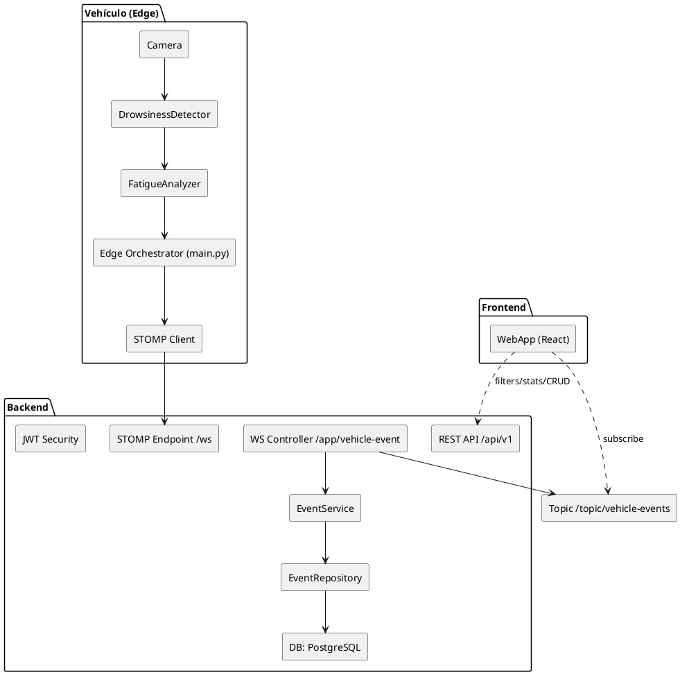
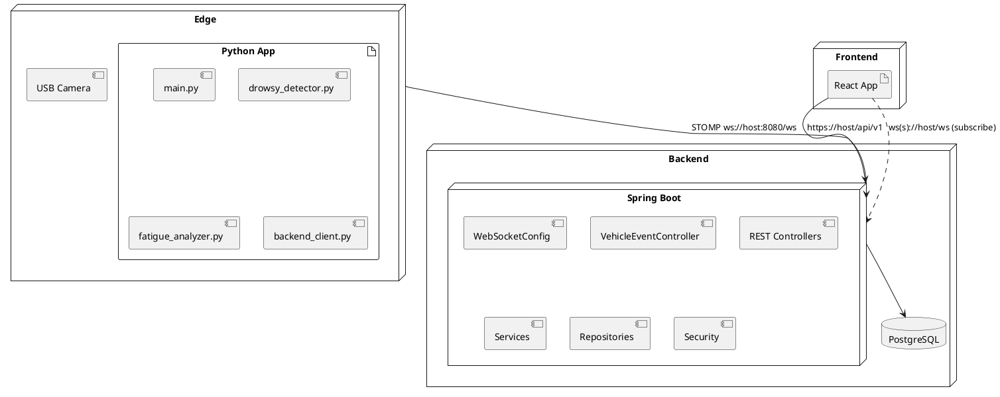

# Detector de Signos de Fatiga (DrowsyGuard)

Documento maestro: Arquitectura integral (Edge/Backend/Frontend), modelos, lógica, endpoints, diagramas y gestión del proyecto.


0. Índice
- 1. Resumen ejecutivo
- 2. Alcance y objetivos
- 3. Arquitectura general y diagramas
  - 3.1 Diagrama de componentes (PlantUML)
  - 3.2 Diagrama de despliegue (PlantUML)
- 4. Edge (Python – Visión + Cliente STOMP)
  - 4.1 Módulos y clases
  - 4.2 Flujos, configuración y operaciones
  - 4.3 Pruebas y métricas
- 5. Backend (Spring Boot – WS, Persistencia, REST, Seguridad)
  - 5.1 Módulos lógicos, capas y paquetes
  - 5.2 Modelos/Entidades JPA y DTOs
  - 5.3 Servicios, reglas y validaciones
  - 5.4 Repositorios y consultas
  - 5.5 Endpoints REST y contratos (OpenAPI)
  - 5.6 WebSocket/STOMP – Ingesta y broadcast
  - 5.7 Seguridad (JWT, Roles, CORS)
  - 5.8 Migraciones (Flyway) y configuración
  - 5.9 Pruebas (unitarias, integración, WS)
- 6. Frontend (Panel Web – UX/UI, Streaming, CRUD)
  - 6.1 Arquitectura FE y librerías
  - 6.2 Secciones, componentes y estados UI
  - 6.3 Suscripción WS y filtros
  - 6.4 Accesibilidad y rendimiento
- 7. Datos y contratos
  - 7.1 Payload Edge→Backend (evento ES)
  - 7.2 Esquema VehicleEvent (persistencia)
  - 7.3 Errores y estructura de respuestas
- 8. No funcionales, observabilidad y DevOps
  - 8.1 Rendimiento, resiliencia y calidad de señal
  - 8.2 Logging, métricas y salud
  - 8.3 CI/CD y entornos
- 9. Gestión del proyecto (RACI, roadmap, riesgos)
- 10. Procedimientos (despliegue, operación, soporte)
- 11. Roadmap evolución
- 12. Glosario

---

## 1. Resumen ejecutivo
DrowsyGuard detecta signos de fatiga (microsueños, cabeceo, bostezos) mediante visión por computadora en el vehículo (Edge) y transmite eventos a un Backend en tiempo real para monitoreo y analítica. Un Frontend ofrece paneles, filtros y CRUD. La solución enfatiza robustez, baja latencia, calibración y privacidad.

## 2. Alcance y objetivos
- Edge (Python): extracción de métricas (EAR/MAR/pose), análisis temporal, alarma local, envío STOMP con reconexión y cola offline.
- Backend (Spring Boot): ingesta STOMP, persistencia (PostgreSQL), API REST con filtros y estadísticas, seguridad JWT y observabilidad.
- Frontend (React/TS): tablero en tiempo real, filtros, analítica y CRUD para conductores, vehículos, reglas y usuarios.

---

## 3. Arquitectura general y diagramas

### 3.1 Diagrama de componentes (PlantUML)


### 3.2 Diagrama de despliegue (PlantUML)


---

## 4. Edge (Python – Visión + Cliente STOMP)

### 4.1 Módulos y clases
- main.py (Orquestación):
  - Carga configuración, configura backend, inicia detector y analizador.
  - Bucle: lectura de cámara → métricas → análisis → overlays → alarma → envío/keepalive.
  - Calibración FPS efectiva, reconexión de cámara, logging y CSV opcional.
  - Teclas: q (salir), o (overlays), a (alarma), s (captura).
- src/drowsy_detector.py (Clase DrowsinessDetector):
  - Tareas: detectar rostro, landmarks; calcular EAR (ojos), MAR (boca), y pose (pitch/yaw/roll con solvePnP).
  - Devuelve métricas crudas y landmarks para overlays.
- src/fatigue_analyzer.py (Clase FatigueAnalyzer):
  - Tareas: suavizado (media móvil), contadores por frames, parpadeo/bostezo, reglas robustas.
  - Microsueño: ojos cerrados sostenidos (EAR < umbral x frames/FPS).
  - Cabeceo: pitch negativo sostenido + ojos cerrados; ignora si MAR alto (bostezo) si está activado.
  - Bostezo: MAR sostenido; yawnCount por minuto.
  - Devuelve payload ES: fatigueLevel (NINGUNO/BAJO/MEDIO/ALTO) y fatigueType (NINGUNO/MICROSUEÑO/CABECEO/BOSTEZO/CANSANCIO_VISUAL).
- src/backend_client.py (Clase StompWebSocketClient + wrappers):
  - Tareas: conexión STOMP resiliente (backoff), cola acotada (deque), persistencia offline JSONL.
  - Envío ensure_ascii=false y content-length por bytes (UTF-8 real).
  - API: configure_backend, connect_to_backend, send_vehicle_data, disconnect_from_backend.

### 4.2 Flujos, configuración y operaciones
- Flujos: ver diagrama 3.1.
- Config: ver sección 5.
- Operaciones: reconexión de cámara; keepalive sin rostro; logs y CSV para tuning.

### 4.3 Pruebas y métricas (Edge)
- Sin rostro: overlay “No se detecta rostro”; keepalive cada N segundos.
- Microsueño: cerrar ojos > (EYE_CLOSED_FRAMES/FPS) → ALTO + alarma.
- Cabeceo: bajar cabeza + ojos cerrados; sin contar con MAR alto.
- Bostezo: MAR sostenido repetido → MEDIO.
- WS caído: cola offline → reconexión → flush.
- Cámara caída: reconectar con backoff.

---

## 5. Backend (Spring Boot – WS, Persistencia, REST, Seguridad)

### 5.1 Módulos lógicos, capas y paquetes
- Config: WebSocketConfig, SecurityConfig, OpenApiConfig, PersistenceConfig.
- WebSocket: VehicleEventController (STOMP), Topics.
- REST: EventController, DriverController, VehicleController, RuleController, UserController.
- Service: EventService, DriverService, VehicleService, RuleService, UserService.
- Repo (JPA): EventRepository, DriverRepository, VehicleRepository, RuleRepository, UserRepository.
- Domain: entidades JPA (VehicleEvent, Driver, Vehicle, Rule, User).
- DTO/Mapper: DTOs + MapStruct (opcional).
- Jobs: RetentionJob (@Scheduled) para purga de eventos antiguos.

### 5.2 Modelos/Entidades JPA y DTOs
- VehicleEvent
  - id: UUID (PK)
  - driverId: String
  - vehicleId: String
  - timestamp: Instant/LocalDateTime
  - fatigueLevel: String (NINGUNO/BAJO/MEDIO/ALTO)
  - fatigueType: String (NINGUNO/MICROSUEÑO/CABECEO/BOSTEZO/CANSANCIO_VISUAL)
  - eyeClosureDuration: double
  - yawnCount: int
  - blinkRate: double
  - Índices: ts, driverId, vehicleId, fatigueLevel
- Driver
  - id (PK), nombres, apellidos, docId (único), fotoUrl, estado, vehicleId asignado, createdAt/updatedAt
- Vehicle
  - id (PK), placa (única), modelo, propietario, estado, driverId asignado, createdAt/updatedAt
- Rule (AlertProfile)
  - id (PK), nombre, earThreshold, marThreshold, pitchDownThreshold, eyeClosedFrames, headNodFrames, yawnFrames, activo, horario (opcional)
- User
  - id (PK), nombre, email (único), rol (OWNER/ADMIN/OPERATOR), passwordHash, activo, createdAt/updatedAt

DTOs de entrada/salida para REST; usar @JsonIgnoreProperties(ignoreUnknown = true) para tolerancia a cambios Edge.

### 5.3 Servicios, reglas y validaciones
- EventService
  - persist(EventDTO) → VehicleEvent
  - findByFilters(driverId, vehicleId, fatigueLevel, fatigueType, from, to, pageable)
  - stats(from, to, driverId, vehicleId): agregados (por nivel/tipo, series por hora/día)
- Driver/Vehicle/Rule/User Services con CRUD y validaciones (únicos, formatos, estado).

### 5.4 Repositorios y consultas
- EventRepository (Spring Data): métodos derivados + @Query para stats.
- Índices para rendimiento en filtros (timestamp, driverId, vehicleId, fatigueLevel).

### 5.5 Endpoints REST y contratos (OpenAPI)
- GET /api/v1/events
  - filtros: driverId, vehicleId, fatigueLevel, fatigueType, from, to
  - paginación: page, size; sort: timestamp,desc
- GET /api/v1/events/stats
  - parámetros: from, to, driverId, vehicleId
  - respuesta: conteos por nivel/tipo, series por hora/día, top conductores/vehículos
- GET /api/v1/events/{id}
- CRUD /api/v1/drivers, /vehicles, /rules, /users
- Seguridad: JWT; roles por endpoint; CORS por entorno.

### 5.6 WebSocket/STOMP – Ingesta y broadcast
- Endpoint STOMP: /ws
- Prefijos: /app (entrada), /topic (salida)
- @MessageMapping("/vehicle-event")
- @SendTo("/topic/vehicle-events")
- Validar y persistir antes de publicar a /topic

### 5.7 Seguridad (JWT, Roles, CORS)
- Roles: OWNER, ADMIN, OPERATOR.
- Login: /api/v1/auth/login → JWT.
- Protecciones: rate limiting básico y CORS por entorno.

### 5.8 Migraciones (Flyway) y configuración
- Flyway: V1__create_tables.sql (drivers, vehicles, rules, users, vehicle_events + índices)
- application.yml: datasources por perfil (dev/staging/prod), jackson jsr310, websockets, CORS.

### 5.9 Pruebas (unitarias, integración, WS)
- Unit: servicios y validadores.
- Integración: repositorios (Testcontainers Postgres), controladores REST.
- WebSocket: simular SEND a /app/vehicle-event; verificar persistencia y broadcast.

---

## 6. Frontend (Panel Web – UX/UI, Streaming, CRUD)

### 6.1 Arquitectura FE y librerías
- React + TypeScript + Vite.
- Estado: Zustand/Redux, React Query para datos.
- UI: Tailwind/Chakra/Ant Design.
- Gráficas: ECharts/Recharts/Victory; mapa (Leaflet/Mapbox, opcional).
- WS: @stomp/stompjs con reconexión.
- i18n: i18next.

### 6.2 Secciones, componentes y estados UI
- Dashboard: KPIs (ALTO hoy, % NINGUNO, blinkRate prom.), timeline en vivo, gráficas por severidad y tipo.
- Monitoreo: tabla streaming con filtros (nivel/tipo/driver/vehículo), panel lateral con mini-chart 10 min.
- Analítica: filtros; líneas/heatmap; ranking conductores/vehículos; export CSV/PDF.
- CRUD: conductores, vehículos, reglas, usuarios (búsqueda, paginación, edición inline/modal).
- Configuración: endpoints, intervalos, thresholds por perfil, tema, densidad, idioma.
- Estados: loading (skeleton), empty, error, no-results; toasts de feedback.

### 6.3 Suscripción WS y filtros
- Suscripción a /topic/vehicle-events.
- Filtros locales (chips) con pausa/reanudar stream.
- Persistencia de filtros en querystring/localStorage.

### 6.4 Accesibilidad y rendimiento
- WCAG 2.1 AA, navegación por teclado, ARIA labels.
- Tablas virtualizadas; lazy-load de módulos pesados.
- Modo oscuro/claro con tokens de diseño.

---

## 7. Datos y contratos

### 7.1 Payload Edge→Backend (evento ES)
```json
{
  "driverId": "PILOTO-001",
  "vehicleId": "VEHICULO-001",
  "timestamp": "2025-08-27T15:14:20.837731",
  "fatigueLevel": "ALTO",
  "fatigueType": "MICROSUEÑO",
  "eyeClosureDuration": 1.6,
  "yawnCount": 0,
  "blinkRate": 18.0
}
```

### 7.2 Esquema VehicleEvent (persistencia)
- driverId (varchar), vehicleId (varchar), timestamp (timestamp/timestamptz), fatigueLevel (varchar), fatigueType (varchar), eyeClosureDuration (double), yawnCount (int), blinkRate (double).
- Índices por timestamp, driverId, vehicleId, fatigueLevel.

### 7.3 Errores y respuestas
- REST error envelope: `{ "code": "BAD_REQUEST", "message": "...", "details": [ ... ] }`
- Validaciones: campos obligatorios, rangos no negativos, formatos de fecha ISO.

---

## 8. No funcionales, observabilidad y DevOps

### 8.1 Rendimiento, resiliencia y calidad de señal
- Edge ≥15 FPS con 450px; ajuste de frames por FPS en runtime.
- Reglas anti-ruido: cabeceo exige ojos cerrados; ignora si MAR alto.
- Reconexión: WS y cámara; persistencia offline JSONL.

### 8.2 Logging, métricas y salud
- Edge: logs rotativos (app.log) y CSV opcional para tuning.
- Backend: Actuator (health/metrics), logs JSON, MDC traceId.

### 8.3 CI/CD y entornos
- CI: build + tests (Edge/Backend/FE) en PR.
- CD: despliegue auto a dev/staging; gate manual para prod.
- Entornos: variables para endpoints, CORS, DB.

---

## 9. Gestión del proyecto (RACI, roadmap, riesgos)
- RACI:
  - Arquitecto/PM (A/R), Backend Lead (R), Frontend Lead (R), Edge/Visión (R), QA (C/R), DevOps (C/R).
- Roadmap (12–16 semanas):
  1) Persistencia + REST filtros (2–3)
  2) Stats básicas (2)
  3) CRUD base + seguridad (2–3)
  4) Frontend v1 (3–4)
  5) Endurecimiento (2)
- Riesgos: performance dlib, umbrales mal calibrados, conectividad; mitigaciones: resolución y periodicidad, perfiles/auto-calibración, reconexión+offline.

---

## 10. Procedimientos (despliegue, operación, soporte)
- Edge:
  - venv → `pip install -r requirements.txt` → `python main.py`.
  - Revisar `models/shape_predictor_68_face_landmarks.dat` y `assets/music.wav`.
- Backend:
  - Spring Boot 3.x + Postgres; Flyway; perfiles por entorno.
  - Swagger/OpenAPI en dev.
- Frontend:
  - React/TS, Vite; `.env` con endpoints; build y deploy estático.

---

## 11. Roadmap evolución
- Backend: agregados avanzados, retention job, roles/granularidad.
- Frontend: mapa con geolocalización, analítica avanzada, workflows de incidentes.
- Edge: auto-calibración guiada, filtro OneEuro para pose, alternativa MediaPipe.
- Evidencias (opt-in): subida segura y correlación eventId/sessionId.

---

## 12. Glosario
- EAR/MAR: métricas de apertura ocular/bucal.
- Pitch/Yaw/Roll: orientación de cabeza.
- STOMP: protocolo de mensajería sobre WebSocket.
- Keepalive: mensaje periódico de actividad.
- DTO: Data Transfer Object.

---
Documento elaborado por Arquitecto de Software / Gestor de Proyecto (20+ años). Completo para ejecutar, evolucionar y operar la plataforma end-to-end. 